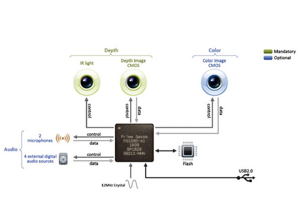

# RGBDCamera on ROS

Assign: Abdallah K. Ezz-Eldeen
Created: February 8, 2023 7:44 PM
Director: Ahmed Ayman
Due: February 12, 2023 → February 15, 2023
Priority: P1 🔥
Status: Complete 🙌
Themes: Computation
Where: Warsha

# RGBD cameras and Kinect v1

RGB-D cameras have a huge impact on the research in the Computer Vision community as well as on related fields like Robotics and Image Processing. These cameras provide dense depth estimations together with color images at a high frame rate. This considerably pushed forward several rese8arch fields such as: 3D reconstruction, camera localization and mapping (SLAM), gesture and object recognition, bilateral filtering, and many more. Recently, several algorithms have been developed using the Microsoft Kinect v1, since it is one of the most common RGB-D devices

[8767_wasenmuller2016comparison.pdf](Assets/8767_wasenmuller2016comparison.pdf)

## Kinect v1 specs:



The Kinect v1 has an IR transmitter and receiver and a rgb camera both of which are at 640x480 @ 30hz. It measures the depth with the Pattern Projection principle, where a known infrared pattern is projected into the scene and out of its distortion the depth is computed.

## Running Kinect v1 on Windows

[Xbox 360 Kinect & Windows 10](https://www.pangodream.es/xbox-360-kinect-windows-10)

Microsoft has provided an official kinect SDK and toolkit for Windows.

**Install** **Kinect for Windows SDK** (**version 1.8**):

1. You can find it at the [Microsoft Site](https://www.microsoft.com/en-us/download/details.aspx?id=40278) 
2. or you can download it from [here](https://mega.nz/#!SJcVTKgT!br9CxdDaenJwvz--uwst5fXRg3hEa_SKNV2gr-Eu8Ac) if it is not available there.

 Install [Kinect for Windows SDK Toolkit](http://go.microsoft.com/fwlink/?LinkID=323589) too. It contains a lot of utilities ****and proof of concepts to show the capabilities of Kinect technology for Windows.

## Kinect v1 on linux

There are two packages that work as drivers/sdks for the kinect, freenect and openi. Freenect is developed by the open source community **OpenKinect. Openni**, however, is developed by PrimeSense the company behind the kinect’s design.

Libfreenect is mainly a driver which exposes the Kinect device's features: - depth stream - IR stream - color(RGB) stream - motor control - LED control - accelerometer. It does not provide any advanced processing features like scene segmentation, skeleton tracking, etc.

On the other hand, OpenNI allows generic access to Kinect's feature (mainly the image streams), but also provides rich processing features such as: - scene segmentation - skeleton tracking - hand detection and tracking - gesture recognition - user interface elements etc. but no low level controls to device features like motor/LED/accelerometer.

As opposed to libfreenect which works only with the Kinect sensor, OpenNI works with Kinect but with other sensors as well like Asus Xtion Pro, Carmine, etc.

## Freenect with ROS

[Getting Started - OpenKinect](https://openkinect.org/wiki/Getting_Started)

### 1. Installing freenect

```bash
sudo apt-get install freenect
```

### Check if kinect is connected

```bash
lsusb | grep Xbox
```

3 devices should be listed

```bash
Bus 001 Device 021: ID 045e:02ae Microsoft Corp. Xbox NUI Camera
Bus 001 Device 019: ID 045e:02b0 Microsoft Corp. Xbox NUI Motor
Bus 001 Device 020: ID 045e:02ad Microsoft Corp. Xbox NUI Audio
```

**If they are not present, or if they are but you can’t receive the camera feed, run :**

```bash
echo -1 | sudo tee -a /sys/module/usbcore/parameters/autosuspend
```

then reconnect Kinect

### Start demo app

```bash
freenect-glview
```

You can find all the demo apps starting with the `freenect-` prefix.

### 2. Installing freenect ROS stack

[GitHub - ros-drivers/freenect_stack: libfreenect based ROS driver](https://github.com/ros-drivers/freenect_stack)
#### Install RGBD launch package
```bash
sudo apt install ros-noetic-rgbd-launch
```
then download the `freenect_camera` and `freenect_launch` packages present [here](https://github.com/ros-drivers/freenect_stack), add them to your workspace then `catkin_make` this workspace

### Launch freenect with ROS

```bash
roslaunch freenect_launch freenect.launch
```

To enable depth registratation : 

```bash
roslaunch freenect_launch freenect.launch depth_registration:=true
```

Depth registration enables 3d point scan with rgb colors in the same message

## 3. Visualizing the data

[openni_launch/Tutorials/QuickStart - ROS Wiki](http://wiki.ros.org/openni_launch/Tutorials/QuickStart)

### RVIZ

We'll use [rviz](http://wiki.ros.org/rviz) to view point clouds:

```
rosrun rviz rviz
```

Set the Fixed Frame (top of the Display panel under Global Options) to /camera_link.

In the Displays panel, click Add and choose the [PointCloud2 display](http://wiki.ros.org/rviz/DisplayTypes/PointCloud). Set its topic to /camera/depth/points. Turning the background color to light gray can help with viewing.

This is the *unregistered* point cloud in the frame of the depth (IR) camera. It is not matched with the RGB camera images. We'll get to color point clouds below. For now, set Color Transformer to AxisColor to colormap the points by distance.

### Image Viewers

View RGB  image:

```bash
rosrun image_view image_view image:=/camera/rgb/image_color
```

View Depth image:

```bash
rosrun image_view image_view image:=/camera/depth/image
```

## Kinect with OpenCV

### Read image and depth message

[GitHub - eric-wieser/ros_numpy: Tools for converting ROS messages to and from numpy arrays](https://github.com/eric-wieser/ros_numpy)

To read the ROS messages and decode them, You could use [ros_numpy](https://github.com/eric-wieser/ros_numpy). It is a great tool for converting ROS messages to and from numpy arrays and vice versa. We will use it to convert the PointCloud2 and Image topics to numpy arrays

### Getting depth at a certain point

First we import the required libraries then initialize the variable and subscribe to topics. The functions are, of course, between the import and initialization

```python
import numpy as np
import rospy
import cv2
import ros_numpy
import math

from sensor_msgs.msg import Image, PointCloud2

## functions are here

click_num = 1
callback_flag = False
current_point = None
rospy.init_node('kinect_length_measurer')
rospy.Subscriber('/camera/rgb/image_color', Image, frame_recieved)
rospy.Subscriber('/camera/depth/points', PointCloud2, depth_scan_recieved)

rospy.spin()
```

Now we numpify the ROS message and show it using opencv. We also set a callback for mouse click to get the x,y location of it.

```python
def frame_recieved(image_frame_msg: Image):
    global image_frame,callback_flag
    image_frame = ros_numpy.numpify(image_frame_msg)
    cv2.imshow('Original', image_frame)
    if not callback_flag:
        cv2.setMouseCallback('Original', click_event)
        callback_flag = True

    # np_frame = np.array(image_frame.data,dtype=np.uint8)
    # print("frame size : ",np_frame.shape)
    # cv2.imshow('Original', np_frame)
    cv2.waitKey(1)
```

When the mouse is clicked, set the global variable current_point to the x,y mouse location

```python
def click_event(event, x, y, flags, params):
    global current_point, image_frame
    # checking for left mouse clicks
    if event == cv2.EVENT_LBUTTONDOWN:
        # displaying the coordinates on the Shell
        print("Finding depth at ", x, y)

        # displaying the coordinates on the image window
        font = cv2.FONT_HERSHEY_SIMPLEX
        cv2.putText(image_frame, '.', (x-6, y), font, 1, (0, 255, 0), 2)
        cv2.imshow('Original', image_frame)

        current_point = [x, y]
```

Print the z coordinate (depth) of the point scan at current_point

```python
def depth_scan_recieved(scan_msg: PointCloud2):
    global current_point,image_frame
    depth_scan = ros_numpy.numpify(scan_msg)
		point_in_m = depth_scan[current_point[1],current_point[0]]
    print("Depth : ",point_in_m[2])
    print(point_in_m)
    cv2.imshow('Original', image_frame)
```

### Measuring length of an object

Since we want to measure an object’s length, we will let user click on 2 points in the image and get the distance between them. To save 2 points on mouse callback, we keep track of the number of clicks and save the points to different variables

```python
def click_event(event, x, y, flags, params):
    global click_num, stpoint, endpoint, image_frame
    # checking for left mouse clicks
    if event == cv2.EVENT_LBUTTONDOWN:
        # displaying the coordinates on the Shell
        print(x, y)

        # displaying the coordinates on the image window
        font = cv2.FONT_HERSHEY_SIMPLEX
        cv2.putText(image_frame, '.', (x-6, y), font, 1, (0, 255, 0), 2)
        cv2.imshow('Original', image_frame)

        if click_num == 1:
            stpoint = [x, y]
            click_num = click_num + 1
        elif click_num == 2:
            endpoint = [x, y]
            click_num = click_num + 1
```

And then we get the 3d points that correspond to the selected points, and calculate the distance between them.

```python
def depth_scan_recieved(scan_msg: PointCloud2):
    global stpoint,endpoint,image_frame,click_num
    depth_scan = ros_numpy.numpify(scan_msg)
    print(click_num)
    if click_num > 2:
        p1_3d = depth_scan[stpoint[1],stpoint[0]]
        print("P1",p1_3d)
        p2_3d = depth_scan[endpoint[1],endpoint[0]]
        print("P2",p2_3d)
        print("Length: ", math.sqrt((p1_3d[0]-p2_3d[0])**2 + (p1_3d[1]-p2_3d[1])**2 + (p1_3d[2]-p2_3d[2])**2))

        cv2.line(image_frame, stpoint, endpoint, (200, 30, 30), 2)
        cv2.imshow('Original', image_frame)
```

## Code Improvements

- Enable depth_registration and use the registered message as each pixel has color and depth information simultaneously instead of being separated into 2 different messages


## REFERENCES
* https://github.com/abhinavtripathi95/tutorials/blob/master/Kinect-v1-for-ROS.md